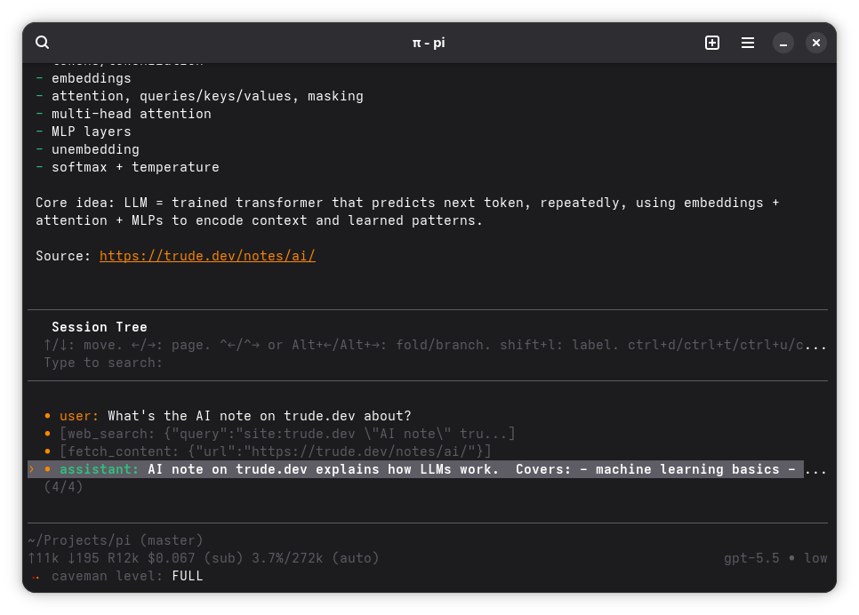

# Trude's Coding Agent

Plugins and configurations for `pi`.



## Installation

```bash
curl -fsSL https://raw.githubusercontent.com/TrudeEH/coding-agent/refs/heads/master/install.sh | bash
```

Installer clones/updates this repo directly at `~/.pi`, installs pi if missing, installs Node/npm/git/curl via Homebrew, apt, dnf, or pacman if missing, installs `rtk`, then runs `pi update` to install plugin dependencies. Edit `~/.pi` directly; changes are git-tracked there.

## Useful Commands

Built-in pi:

- `/login` - authenticate provider.
- `/model` - switch model.
- `/settings` - change thinking level, transport, etc.
- `/reload` - reload extensions, skills, and prompts.
- `/session` - show current session info.
- `/resume` - resume previous session.
- `/compact` - compact context.

Custom:

- `/plan` - open plan manager.
- `/plan on` - planning mode; read-only exploration.
- `/plan off` - leave planning mode.
- `/ssh user@host[:/path]` - run pi tools remotely over SSH.
- `/ssh status` - show SSH routing state.
- `/ssh off` - disable SSH routing.
- `/pi` - show LLM-visible tools and injected skills.
- `/skill:librarian` - research OSS library internals with source links.
- `/skill:pi-subagents` - delegate work to subagents/chains/parallel runs.
